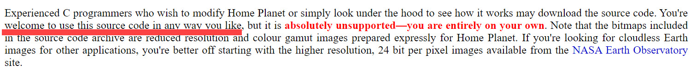

# starmap-obe

starmap-obe is a star/planets engine that can be either set as an Arduino library, used on a raspberry Pi with a screen and a way to set time (internet connection or RTC), or executed on a Linux/macOS computer.
The project needs to be compiled to the correct platform.

|  | 
|:--:| 
| *Twinkle, twinkle litte star ...* |

## Acknowledgments
Based on starmap : [shabaz123's starmap](https://github.com/shabaz123/starmap). This project has been largely based on starmap with a few tweaks for my needs. All credit goes to them for making this awesome project.

## get the project

``` bash
git clone https://github.com/obenchekroun/starmap-obe
cd starmap-obe
```

## Building library from source

If you want to build the library from source, you can clone the code into a folder onto your Linux machine, then go into the starmap folder, and type:

```
chmod 755 make_libraries.py
./make_libraries.py
```

The output will be two zip files, one folder up from the starmap folder. The zip file titled `starmap_library-1.0.0.zip` will be the bundled library that you can add into the Arduino development environment (using **Sketch->Include Library->Add .ZIP file**).

The other zip file that will be generated, called `starmap_lib.zip` is useful for CMake projects for non-Arduino platforms, such as Pi Pico C/C++ SDK. It can be ignored if you're using Arduino.

## starmap on Linux
If you wish to test the code on Linux, prior to uploading to any microcontroller, then you can do that by typing:
```
cd starmap-obe/examples/StarmapLinuxTest
mkdir -p build
cd build
cmake ..
make
```

By doing that, a `starmap` Linux executable will be built in the build folder. Note that you may need to install `libpng` on your Linux machine beforehand (on Ubuntu, you can type `sudo apt install libpng`). You can run the starmap executable by typing:

```
./starmap
```

It will generate a star chart PNG file (called out.png) which can be inspected.

## starmap on MacOS
If you wish to test the code on macOS, then you can do that by typing:
```
cd starmap-obe/examples/StarmapMacOS
mkdir -p build
cd build
cmake ..
make
```

By doing that, a `starmap` macOS executable will be built in the build folder. Note that you may need to install `libpng` on your MacOS machine beforehand (you can type `brew install libpng`). You can run the starmap executable by typing:

```
./starmap
```

It will generate a star chart PNG file (called out.png) which can be inspected.
```
open sky.png
```

## starmap on RPi Zero 2W + round 1.28'' screen + DS3231 RTC

### Required hardware
- Raspberry Pi Zero 2W [link](https://www.raspberrypi.com/products/raspberry-pi-zero-2-w/)
- 240×240, General 1.28inch Round LCD IPS Display Module, with GC9A01 driver. 
   - The Waveshare display has an onboard voltage regulator and can be used with either 3.3 or 5-volt logic, the power supply voltage should match the logic level (although you CAN use a 5-volt supply with 3.3-volt logic). [link](https://www.waveshare.com/1.28inch-lcd-module.htm).
   - Some alternatives have no onboard voltage regulator, so it is limited to working with 3.3-volt logic, and can be found on Aliexpress
   - The driver used is the GC9A01
- PiSugar3 for RpiZero [link](https://www.tindie.com/products/pisugar/pisugar-3-battery-for-raspberry-pi-zero/) or Waveshare UPS HAT (C) for RPi Zero [link](https://www.waveshare.com/wiki/UPS_HAT_(C)).
- DS3231 RTC module. Adafruit has a compact one [link](https://www.adafruit.com/product/3013), but any can do. *NB: PiSugar has an RTC embedded*.

###  Dependencies
The following dependencies need to be installed :
```
sudo apt update
sudo apt upgrade
sudo apt install cmake libpng-dev unzip
sudo apt install liblgpio-dev
sudo apt install python3-smbus i2c-tools # for DS3231
```

### Setting up
1. Image the SD card with RPi OS Bookworm 64bit lite, then boot and update the OS.
2. Set locale correctly using the following :
``` bash
locale #to see locales
sudo update-locale "LC_ALL=en_GB.UTF-8"
sudo update-locale "LANGUAGE=en_GB:en"
```
then reboot.

3. Go to `sudo raspi-config` and enable the following
 - `I2C` interface (for the DS3231 RTC)
 - `SPI` interface (for the screen)
 - [OPTIONAL] `ssh`
 - [OPTIONAL] set up wifi

4. Install required dependencies (see above)

5. Connect the hardware (screen and RTC) and setup RTC (see below)

6. Clone this repository. `git clone https://github.com/obenchekroun/starmap-obe.git`

### Building
```
cd starmap-obe/examples/StarmapRPiZero
mkdir -p build
cd build
cmake ..
make
```

By doing that, a `starmap`  executable will be built in the build folder. 

You can then execute `./starmap`.

If you get the following error `Debug : gpiochip0 Export Failed`, it means there is a permission problem. either execute as `sudo`, `sudo ./starmap`.

### Usage
You can run the starmap executable by typing:
```
./starmap
```

It will continously display the chart on the screen + the time. Default refresh of the sky image is 5 minutes, but can be changed in `starmap-obe/examples/StarmapRPiZero/main.cpp`, by changing the value of this definition `#define DEFAULT_UPDATE_DELAY 5 // in minutes`
It will also generate a star chart PNG file (called sky.png) everytime the sky is refreshed, which can be inspected

### Connecting the hardware
#### Connecting the screen

| LCD | BCM2835 (GPIO number) | Board (Pin) |
|-----|-----------------------|-------------|
| VCC |                  3.3V |        3.3V |
| GND |                   GND |         GND |
| DIN |                  MOSI |          19 |
| CLK |                  SCLK |          23 |
| CS  |                   CE0 |          24 |
| DS  |                    25 |          22 |
| RST |                    27 |          13 |
| BL  |                    18 |          12 |

*NB : BL is the connector for the backlight control. It is not present on some screen model*

|  |
|:--:| 
| *screen connection diagram* |

#### Connecting and setting up the DS3231 RTC
1. Enable I2C : `sudo raspi-config` and enable i2c in Interface Options > I5 I2C then reboot `sudo reboot`
2. Install required libraries and tools : `sudo apt install python3-smbus i2c-tools`
3. Connect the DS3231, following this pining :

| DS3231  | RPi connection | RPi pin | 
| --- | --- | --- |
| VCC  | 3V3 | Pin 1 |
| GND  | GND | Pin 6 e.g  |
| SDA  | GPIO 2 | Pin 3  |
| SCL  | GPIO 3 | Pin 5  |

|  |
|:--:| 
| *RPi Zero 2W Pin out diagram* |

4. Edit /boot/config.txt by adding dtoverlay config and reboot : 
 * `sudo nano /boot/firmware/config.txt`
 * Add the following : 
 ```
 #dtoverlay for RTC DS3231 on specific pin
 dtoverlay=i2c-rtc-gpio,ds3231,i2c_gpio_sda=2,i2c_gpio_scl=3
 ```
Make sure that the GPIO pin in the dtoverlay code corresponds to the pinning of the DS3231 to the RPi.
 * Then reboot `sudo reboot`

5. To detect and list i2c hardware :
``` sh
 sudo i2cdetect -l # list devices
 sudo i2cdetect -y 11 # (replace 11 with bus, usually 11 for this dtoverlay with i2c-rtc-gpio )
```
Output :

``` sh
     0  1  2  3  4  5  6  7  8  9  a  b  c  d  e  f
00:                         -- -- -- -- -- -- -- -- 
10: -- -- -- -- -- -- -- -- -- -- -- -- -- -- -- -- 
20: -- -- -- -- -- -- -- -- -- -- -- -- -- -- -- -- 
30: -- -- -- -- -- -- -- -- -- -- -- -- -- -- -- -- 
40: -- -- -- -- -- -- -- -- -- -- -- -- -- -- -- -- 
50: -- -- -- -- -- -- -- 57 -- -- -- -- -- -- -- -- 
60: -- -- -- -- -- -- -- -- 68 -- -- -- -- -- -- -- 
70: -- -- -- -- -- -- -- --   
```
68 is code of RTC clock
if UU appear, mean driver loaded. Otherwise, verify /boot/config.txt and reboot.

6. Now that we have successfully got the kernel driver activated for the RTC Chip and we know it’s communicating with the Raspberry Pi, we need to remove the “fake-hwclock“ package. This package acts as a placeholder for the real hardware clock when you don’t have one.

``` sh
sudo apt-get -y remove fake-hwclock
sudo update-rc.d -f fake-hwclock remove
sudo systemctl disable fake-hwclock
```

7. Now that we have disabled the “fake-hwclock” package we can proceed with getting the original hardware clock script that is included in Raspbian up and running again by commenting out a section of code.
Run the following command to begin editing the original RTC script.

``` sh
sudo nano /lib/udev/hwclock-set
```
and comment out : 

``` sh
#if [ -e /run/systemd/system ] ; then
# exit 0
#fi

```

8. Now, if we have to sync time of the RTC to the one of the RPi (obtained with internet connection) :

``` sh
sudo hwclock -r #get time from RTC clock
date #see if time is correct of RPi
sudo hwclock -w # write time to RTC
```

#### running on startup
The run on startup is provided by a systemd service, callin the script `run.sh`. By modifying command-line option inside the script, the call can be configured.

#### Configuring the script `run.sh`

- edit the `run.sh` script :
``` bash
nano run.sh
```

  - Once `run.sh`is configured, we have to make it executable :
  ```bash
  sudo chmod +x run.sh
  ```
  
  - Lastly we just want to make this run at boot as a systemd service.
``` bash
sudo chmod +x run.sh
sudo cp starmap-obe.service /etc/systemd/system
sudo systemctl enable starmap-obe.service #to launch service on startup
sudo systemctl daemon-reload
sudo journalctl -u starmap-obe.service #to get journal
```

- The service can be started, stopped, restarted and checked :
``` bash
$ sudo systemctl start starmap-obe.service
$ sudo systemctl stop starmap-obe.service
$ sudo systemctl restart starmap-obe.service
$ systemctl status starmap-obe.service
```

NB : The user created is named pi, if another user or project put in another folder, change the `Working Directory` section of the `starmap-obe.service`.


### Misc

#### Waveshare test library

You can use Waveshare test library to test the display. It is included in the `examples/screentest` folder :

``` sh
cd starmap/examples/screentest
mkdir -p build
cd build
cmake ..
make
```

and then test it :
``` sh
sudo ./screentest 1.28
```

#### Downloading from Waveshare website
You can also use the Waveshare test library to test the display bu downloading it from Waveshare website. Here are the instructions found in the [wiki](https://www.waveshare.com/wiki/1.28inch_LCD_Module) :

``` sh
sudo wget https://files.waveshare.com/upload/8/8d/LCD_Module_RPI_code.zip
sudo unzip ./LCD_Module_RPI_code.zip 
cd LCD_Module_RPI_code/RaspberryPi/
```

then build it : 
``` sh
cd c
sudo make clean
sudo make -j 8
```

 and test it for the corresponding display :
``` sh
#1.28inch LCD Module
sudo ./main 1.28
```

## Starmap on RP2040/RP2350 wifi board + Pico Display Pack 2.0 (or 2.8) + DS3231 + GPS module

### Required hardware
- RP2040 or RP2350 board
- Pimoroni Display Pack 2.0
- DS3231 RTC module. Adafruit has a compact one [link](https://www.adafruit.com/product/3013), but any can do. *NB: PiSugar has an RTC embedded*.
- GPS module LC76G from waveshare (but any GPS module communicating through UART is good)

Embedded flash memory is used to store last GPS position for quick rebooting if the GPS position is unavailable after a reboot. This is done by writing the GPS positon to flash when fix is obtained, and then loaded at startup. Some basic wear protection for is done by writing data to 16 pages (on full sector), and waiting that the all 16 are full before erasing the memory.

The build uses Wi-Fi capabilities to set DS3231 time when wifi is available through NTP. By default, this is on but can be switched off by setting the  `WITH_NTP` variable to 0 in `CMakeLists.txt`.
The use of GPS is  optional. To deactivate it, set the  `WITH_GPS` variable to `0` in `CMakeLists.txt`.
The use of flash memory to store previous location is also optional. To deactivate it, set the  `WITH_SAVE_LOCATION` variable to `0` in `CMakeLists.txt`. *NB : this only works if GPS is used*

See building for how to create the personalised firmware.

###  Dependencies
The firmware can be built on any linux machine. You need to set up the pico-SDK :

#### Setting up pico SDK
```
sudo apt update
sudo apt upgrade
git clone https://github.com/raspberrypi/pico-sdk
cd pico-sdk
git submodule update --init
export PICO_SDK_PATH=`pwd`
cd ../
```

You should should ensure your `PICO_SDK_PATH` environment variable is set by `~/.profile`

``` bash
nano ~/.profile
```
 and add `export PICO_SDK_PATH="/path/to/pico-sdk"` at the end.
 
 #### Correcting linker Flash size definition (in case an error of Flash overflow occurs) if using other RP2040 boards
 
 **This has been resolved as of Jan 12th 2025. No need to manually change the value**
 
 As of May 17th 2024, linker scripts are not generated from templates at build time, and do not allow for substitution of board parameters. They are hardcoded in `pico-sdk/src/rp2_common/pico_standard_link/memmap_default.ld`. We need to change that manually for the firmware to compile. See this github issue [#398](https://github.com/raspberrypi/pico-sdk/issues/398), this one [#8680](https://github.com/micropython/micropython/issues/8680) and this [thread](https://forums.raspberrypi.com/viewtopic.php?t=311163) on Raspi Forum.
To do so, we edit the `pico-sdk/src/rp2_common/pico_standard_link/memmap_default.ld` and change the FLASH size to 4MB (`4194304` B or `4096k`).

```bash
cp memmap_default.ld memmap_default.ld~
nano memmap_default.ld
```
 and change the `MEMORY {  }` section to :

``` bash
MEMORY
{
    FLASH(rx) : ORIGIN = 0x10000000, LENGTH = 4096k
    RAM(rwx) : ORIGIN =  0x20000000, LENGTH = 256k
    SCRATCH_X(rwx) : ORIGIN = 0x20040000, LENGTH = 4k
    SCRATCH_Y(rwx) : ORIGIN = 0x20041000, LENGTH = 4k
}
```
*NB: This is the file used for linker for rp2040 boards. For other boards, seek for the corresponding files each corresponding `ports` folder* 
 
### Building
- Setting  board is done by passing the correct variable to cmake `-DPICO_BOARD=pico_w`. It can also be set in `CMakeLists.txt` through `set(PICO_BOARD pico_w)`.
    - List of boards can be find here : `pico-sdk/src/boards/include/boards/` 
- Pin used for the RTC are in `main.cpp` : 
``` c++
#define RTC_SDA_PIN 4
#define RTC_SCL_PIN 5
#define RTC_INT_PIN 18
```

- Pin used for the GPS

| GPS | RP pico     | RP pico pin |
|-----|-------------|-------------|
| VCC | 3V3         | Pin 36      |
| GND | GND         | Pin 38 e.g  |
| RX  | TX - GPIO 0 | Pin 1       |
| TX  | RX - GPIO 1 | Pin 2       |

- `BAUDRATE` for the GPS : The GPS baudrate should be set in `main.cpp` : 

``` c++
#define GPS_BAUD_RATE 115200
```
Make sure to correctly set the BAUDRATE to the one of your GPS chip, otherwise the code won't work. You can change the default baudrate of your chip by sending specific command (e.g $PMTK251 command for waveshare LC76 and adafruit GPS module). To do so, initialise an uart connection with current baudrate, send the command, and then open a new serial connection with new baudrate. As long as a battery is connected, the GPS module should keep the defined baudrate. You can use the code of `examples/test_gps` to do so.

- Timezone offset for the NTP, in `main.cpp` : 
``` c++
#define TIMEZONE_OFFSET 1 // time offset, example: 1 hour ahead of UTC (e.g. Africa/Casablanca Time) is 1
```

- To define the use of NTP (and need of wi-fi capabilities), you can either :
    - add or remove`#define WITH_NTP 1` in the beginning of `main.cpp`
    - set `set(WITH_NTP 1)` in `CMakeLists.txt`. This is the default on the current code.
    
- To define the use of GPS, you can either :
    - add or remove`#define WITH_GPS 1` in the beginning of `main.cpp`
    - set `set(WITH_GPS 1)` in `CMakeLists.txt`. This is the default on the current code.
    
- To define the use of pimorioni display pack 2.0'' or 2.8'', you can either :
    - add or remove`#define WITH_DISPLAY_PACK_28 1` in the beginning of `main.cpp`
    - set `set(WITH_DISPLAY_PACK_28 1)` in `CMakeLists.txt`. By default, This is the default on the current code
    
- To define the save last location to flash,, you can either :
    - add or remove`#define WITH_SAVE_LOCATION 1` in the beginning of `main.cpp`
    - set `set(WITH_SAVE_LOCATION 1)` in `CMakeLists.txt`. This is the default on the current code.
    - The last location is saved with writing the GPS positon to flash when fix is obtained, and then loaded at startup. Some basic wear protection for is done by writing data to 16 pages (on full sector), and waiting that the all 16 are full before erasing the memory. The sector chosen is the penultimate one from flash, this can be changed in `main.cpp` : 
``` c++
#ifdef WITH_SAVE_LOCATION
#define FLASH_TARGET_OFFSET (PICO_FLASH_SIZE_BYTES - 2*FLASH_SECTOR_SIZE) // working on penultimate sector
#endif
```

- The board and platform are defined in `CMakeLists.txt`

``` cmake
set(PICO_BOARD pico2_w)
set(PICO_PLATFORM rp2350)
```

Once everything is set up,  building it is done with :
```
cd starmap-obe/examples/StarmapPico
mkdir -p build
cd build
cmake .. -DWIFI_SSID="<your wifi ssid>" -DWIFI_PASSWORD="<your wifi password>"
make
```
*Make sure to put the correct values for `<your wifi ssid>` and `<your wifi password>`*.
These values can be set in the `CMakeLists.txt` with the lines `set(WIFI_SSID "<PUT WIFI SSID HERE>")` and `set(WIFI_PASSWORD "<PUT WIFI PASSWORD>")`.

A `starmap.uf2`  firmware is generated that can be flashed on the microcontroller.

### Usage
Flashing the firmware will get you running. 
On startup, the pico will attempt for 10 sec to get to wifi and update the time of the DS3231. If failed, it will pull the time from the DS3231.
The code makes use of the 4 buttons on the Pimoroni pico display pack :
- `X` : switch between manual mode and auto mode : 
  - Manual mode allows you to get forward and backward in time resp. with the buttons `B` and `A`. in this mode, the screen won't be updated unless a button is pressed
  - Auto mode is set to current date and time, with the screen updating the datetime every minute and the map once every five minutes.
  - In manual mode, `A` and `B` buttons add or remove one hour to the current time. Keeping the button pressed gradually increment the number of hours until released, allowing the calculation to be made and the screen to be updated. The number of hours that will be added and the button is released is shwon as small number is shown below the hour figure. 
- `Y` : cycles through magnitude from [-1 ; 5]

#### Visual indicators
starmap-obe relies on some visual indication for tracking usage :
- *LED* : The screen led will be `white` in auto mode, `blue` in manual mode, and `yellow` while the starmap is computed
- *Manual text on the bottom left* : when in manual mode, `MANUAL` is written in blue on the bottom left of the screen
- *Coordinates* : the color of the coordinates depends on fix status and origin of location
  - `gray color/white color` means that it is the default hardcoded coordinates
  - `green color` means that coordinates are from gps fix and recent. The `green color` will eventually fade to `yellow` then `red` gradually with each iteration of calculation (every minutes in auto mode) if the coordinates are not refreshed from the gps (e.g fix lost)
  - `purple color` means coordinates are the one read from flash, i.e the last saved coordinates

### Serial console
``` bash
ls /dev/tty.*
screen /dev/tty.usbmodem101 115200 # or
minicom -b 115200 -o -D /dev/tty.usbmodem101
```


## Acknowledgement

### Homeplanet code
Note: This code uses content from https://www.fourmilab.ch/homeplanet/ (public domain code).

See the screenshot here:



### Images of planets

Planets icons are inspired from [here](https://51n1.itch.io/8x8-pixel-art-asset?download) and pluto from [here](https://www.reddit.com/r/PixelArt/comments/as0xen/oc_pluto/) from user u/IIPorkinsII.
